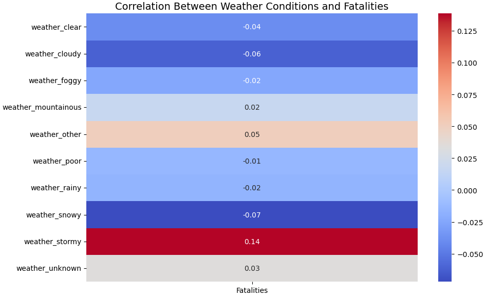
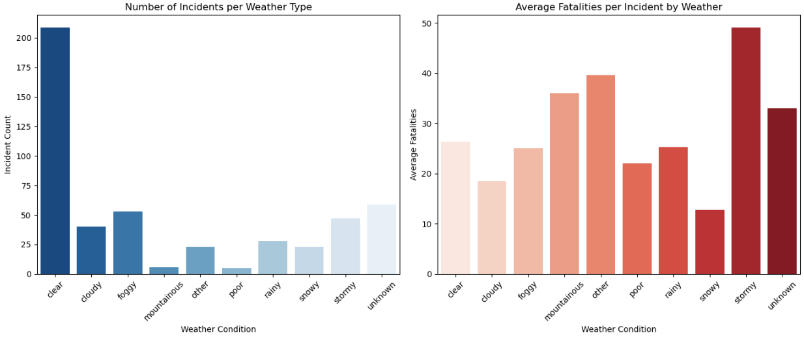

# ✈️ Plane Crash Data Analysis (2000–2025)

This project presents a comprehensive analysis of global airplane incidents between **2000 and 2025**, using real-world data. It explores **survivability patterns**, **weather impacts**, **incident causes**, and applies **machine learning** techniques to uncover hidden patterns and make predictions.

---

## 🌟 Objectives

### Core Objectives

1. **Calculate Survivor & Fatality Rate (per year)**
2. **Visualize Survivors and Fatalities per Year**
3. **Count How Many Times Each Cause of Incident Occurred**
4. **Identify Years with the Highest Number of Incidents**
5. **Which Flights, Operators, and Aircraft Types Had the Most Incidents?**
6. **Analyze Weather Conditions with the Highest Incident Rates**
7. **Check for Repeated Crashes on the Same Travel Route**
8. **Correlation Analysis**:
   - (a) Between Weather and Number of Incidents
   - (b) Between Weather and Fatalities
9. **Comparative Analysis**: Weather vs. Incident Frequency and Fatality Severity
10. **KMeans Clustering**: Unsupervised Analysis of Incident Patterns
11. **NLP Classification**: Clustering Crash Causes using TF-IDF + KMeans
12. **Predict Survivability** using Logistic Regression
13. **Predict Fatalities** using Linear Regression (Occupants + Weather)
14. **Predict Fatalities** using Decision Tree Regressor
15. **Estimate Probability** of Survival and Fatality using Naive Bayes

### Additional Objectives

- Survivor & Fatality Rate Analysis (2000–2025)
- Visualized Frequency of Incident Causes
- Annual Incident Rate (%) Computation
- Weather Impact Analysis (Non-Visual)
- Cluster Interpretation: Meaning and Characteristics of Groups

---

## 🔧 Tools & Technologies Used

- **Language**: Python
- **Libraries**:
  - `pandas` – Data wrangling and transformation
  - `matplotlib`, `seaborn` – Visualizations
  - `scikit-learn` – Machine Learning (Clustering, Regression, Classification)
  - `TF-IDF Vectorizer` – Text vectorization (NLP)
- **IDE**: Jupyter Notebook

---

## 📊 Key Insights

- **Fatality rates have decreased in recent years**, while survivor rates vary based on weather and aircraft type.
- **Weather conditions** such as fog, storm, and rain were linked to **higher fatality rates** and more incidents.
- Some **flight routes and operators** experienced repeated crash patterns.
- **KMeans clustering** uncovered distinct groups based on incident characteristics.
- **Logistic regression and Naive Bayes** were useful in predicting survival outcomes.
- **Decision Tree models** performed better than Linear Regression for predicting fatalities.

---

## 📸 Visual Highlights

### Correlation Between Weather and Fatalities


### Incidents vs Average Fatalities


---

## 🚀 How to Run

2\. \*\*Clone the repository\*\*:

\```bash
git clone https://github.com/AsharAftab20056/Flight-Incident-Project.git


2\. \*\*Install dependencies\*\*:

\```bash

pip install -r requirements.txt

\```

3\. \*\*Run the notebook\*\*: Open `Flight Incidents.ipynb in Jupyter Notebook or JupyterLab and run all cells.
 

Download the dataset: https://drive.google.com/file/d/149kSdIvsP8ywmb9V9K516TWw4mB80eAj/view?usp=sharing

\```

\---

\## 👤 Author

\*\*Ashar Aftab \*\*\

GitHub: https://github.com/AsharAftab20056/Flight-Incident-Project

LinkedIn: www.linkedin.com/in/ashar-aftab-b09924295


\---

\> If you found this project useful or insightful, consider giving it a ⭐ on GitHub!


